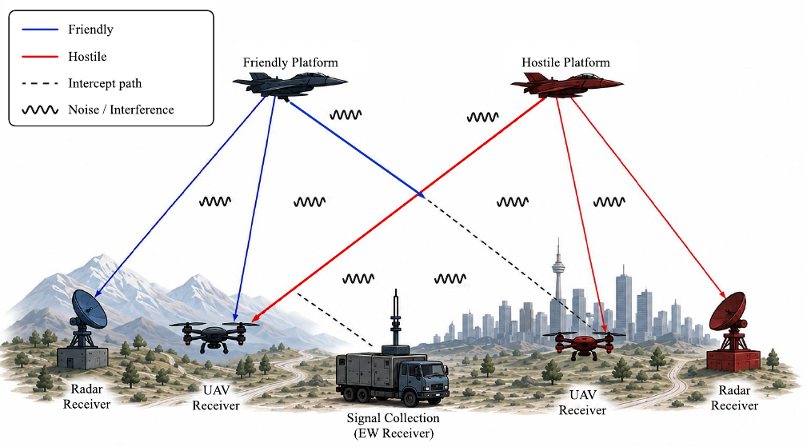

## 연구 질문

여러 RF 신호가 동일 spectrum에서 공존하거나 중첩되는 환경에서 원하는 신호를 어떻게 탐지·식별·복조할 것인가?

이 연구 축은 단일 파형 분류를 넘어, fading·중첩·주파수 공유 조건에서 관측된 신호를 식별하고 필요한 신호처리 단계를 연결하는 문제를 다룹니다.

## 연구 흐름

  
<strong>2021</strong>페이딩 기반 전파식별과 주파수 공유 평가

  
<strong>2022–2023</strong>이종신호 중첩 환경 전파식별·주파수 공유 평가

  
<strong>2023</strong>ResNeXt 기반 LPI 레이다 중첩 신호 다중 라벨 분류

  
<strong>2024–현재</strong>DJI OcuSync 프로토콜 기반 OFDM 드론 신호 복조

## 주요 연구

### 페이딩 기반 전파 식별

전파 환경의 fading 특성이 신호 식별과 주파수 공유 판단에 미치는 영향을 평가합니다.

### 이종신호 중첩

서로 다른 RF 신호가 중첩되는 환경에서 원하는 신호와 간섭 신호를 구분하는 방법을 연구합니다.

### LPI 다중 라벨 인식

중첩된 LPI 레이다 신호 인지를 위해 ResNeXt 기반 다중 라벨 분류를 적용한 연구를 학회 발표로 확장했습니다.

### OFDM 드론 신호 처리

DJI OcuSync 프로토콜 기반 OFDM 드론 신호의 복조 구현으로 연구 범위를 실제 신호처리 체인으로 연결합니다.

[공존 전자파 환경 figure PDF](figures/electromagnetic_environment.pdf)

## 관련 학회 발표

**LPI 레이다 중첩 신호 인지를 위한 ResNeXt 기반 다중 라벨 분류** 
한국통신학회 하계종합학술발표회, 제주, 2023.06

## 관련 수행 과제

- DJI OcuSync 프로토콜 기반의 OFDM 드론 신호 복조 구현 · 엘아이지넥스원 (LIG) · 2024.03–현재
- 이종 신호 중첩 환경 전파식별 방법과 주파수 공유방법에 대한 평가 연구 · 한국전자통신연구원 (ETRI) · 2022.01–2023.12
- 페이딩 기반의 전파식별 방법과 주파수 공유 방법에 대한 평가 연구 · 한국전자통신연구원 (ETRI) · 2021.04–2021.11

<a class="cv-text-link" href="../../rd-projects/">전체 수행 과제 보기 →</a>
