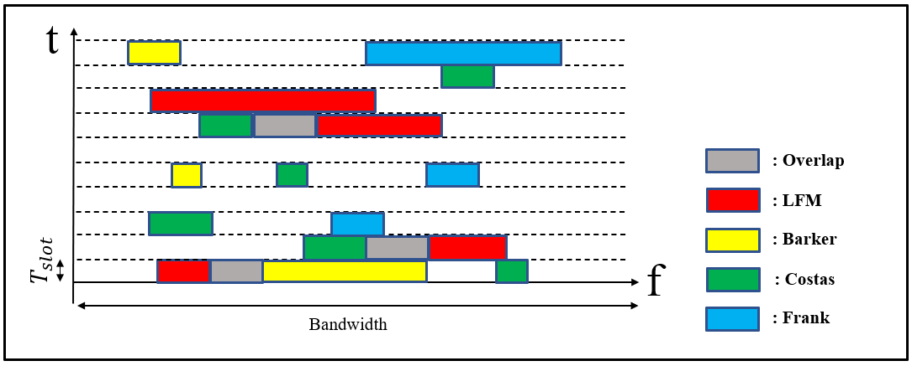
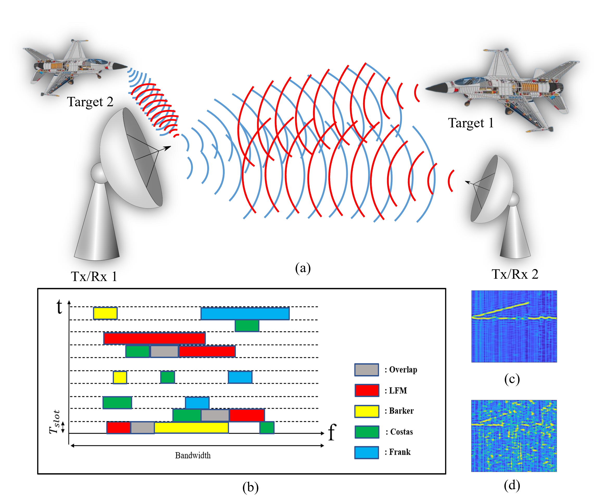
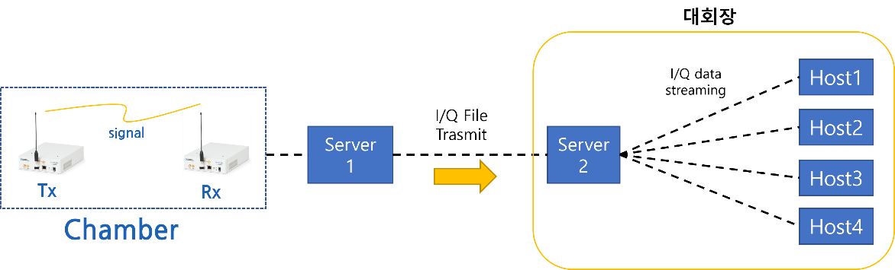
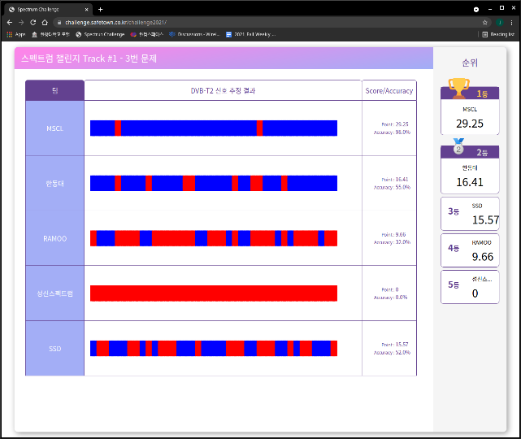

## 문제 정의

전자전과 주파수 공유 환경에서는 여러 RF 신호가 같은 대역에서 공존하거나 중첩됩니다. 관측된 신호에서 원하는 신호를 식별하고, 간섭과 공존 조건을 고려해 다음 신호처리 단계로 연결하는 것이 핵심 문제입니다.

*시간 슬롯과 주파수 점유를 고려해야 하는 공존 환경*

*중첩 LPI 레이더 신호를 인지해야 하는 문제*

## 제안 방법

  Signal input<b>→</b>Coexistence analysis<b>→</b>Signal identification<b>→</b>Multi-label recognition<b>→</b>Real-time evaluation

- **Fading-based identification:** 페이딩 조건이 전파 식별과 주파수 공유 판단에 미치는 영향을 평가합니다.
- **Overlapped-signal recognition:** 이종 신호가 중첩되는 환경에서 원하는 신호와 간섭 신호를 구분합니다.
- **LPI multi-label recognition:** 중첩된 LPI 레이더 신호 인지를 위해 ResNeXt 기반 다중 라벨 분류를 적용합니다.

## 실제 검증

- **2021:** 페이딩 기반의 전파식별 방법과 주파수 공유 방법에 대한 평가 연구
- **2022–2023:** 이종 신호 중첩 환경 전파식별 방법과 주파수 공유방법에 대한 평가 연구
- **2023:** LPI 레이다 중첩 신호 인지를 위한 ResNeXt 기반 다중 라벨 분류 학회 발표

학회 발표와 ETRI 연구과제를 통해 공존 신호 분석에서 다중 라벨 인식과 실시간 평가 시스템으로 연구 범위를 확장했습니다.

*실시간 송수신과 자동 평가를 연결한 검증 시스템*

## 주요 결과

  신호 분리·인지실시간 처리자동 평가

*신호 인지 결과를 확인하는 웹 기반 실시간 평가 화면*

이 연구 축은 단일 파형 분류를 넘어, 중첩·공존 환경에서 신호를 식별하고 자동 평가까지 연결하는 실시간 신호 인지 시스템으로 확장되었습니다.

**관련 학회 발표** · LPI 레이다 중첩 신호 인지를 위한 ResNeXt 기반 다중 라벨 분류 · 한국통신학회 하계종합학술발표회 · 제주 · 2023.06

[수행 과제 전체 보기](../../research/#research-tasks)
