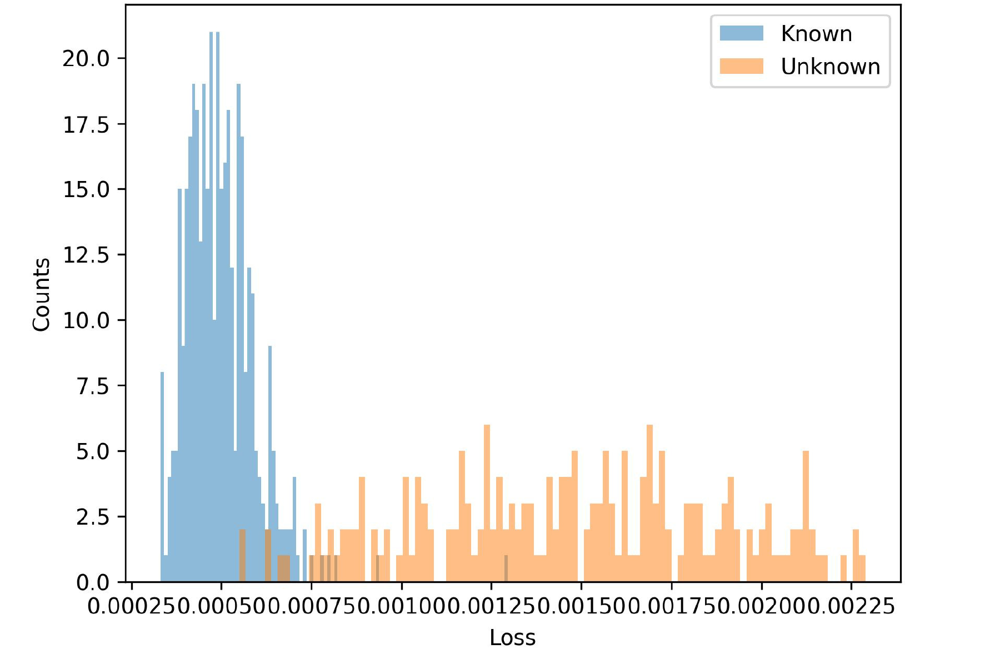
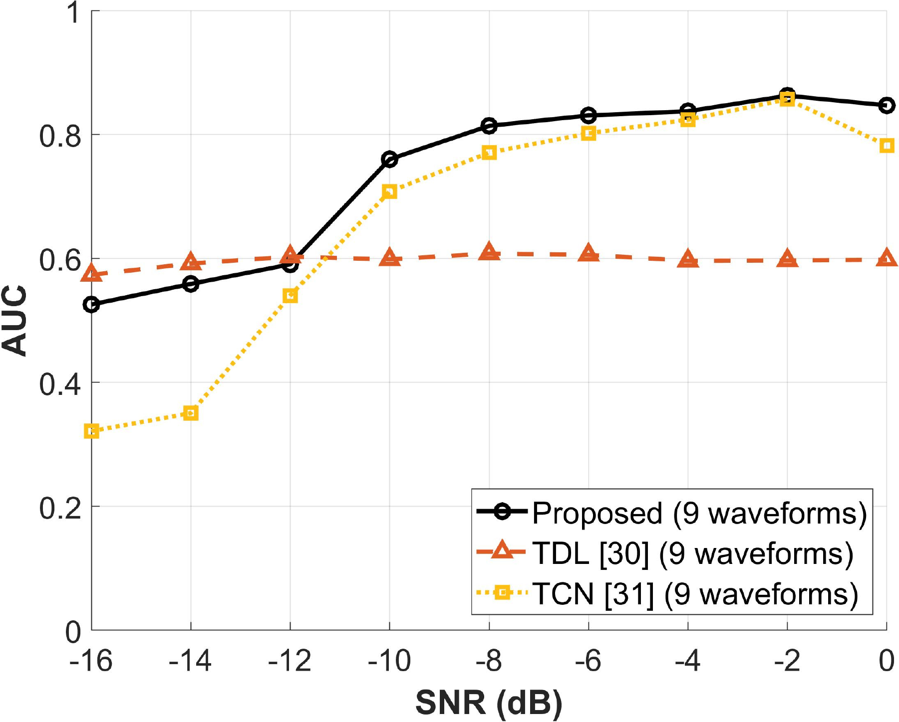

## 문제 정의

실제 전자전 환경에서는 학습 데이터에 포함되지 않은 새로운 레이다 파형이 지속적으로 등장할 수 있습니다. 일반적인 closed-set classifier는 unknown 입력을 기존 known class 중 하나로 잘못 분류할 수 있습니다.

이 연구의 문제는 **unknown-class label과 clean reference signal이 없는 조건에서, known waveform은 유지하면서 unseen waveform을 별도로 탐지하는 것**입니다.

  Known A<b>+</b>Known B<b>+</b>Known C<b>→</b>Unknown 입력을 기존 class로 강제 분류

## 제안 방법

  저 SNR Radar I/Q<b>→</b>CWD-TFA<b>→</b>DSAE noise suppression<b>→</b>MAAE known-pattern reconstruction<b>→</b>Reconstruction discrepancy<b>→</b>Known / Unknown

- **DSAE:** paired clean target 없이 noisy CWD 기반 시간–주파수 입력에서 noise-suppressed representation을 학습합니다.
- **MAAE:** known waveform pattern을 memory entry로 학습하고, 입력을 known-biased memory를 통해 복원합니다.
- **Unknown score:** known 입력은 낮은 reconstruction discrepancy, unseen 입력은 높은 discrepancy를 갖도록 연속적인 탐지 score를 구성합니다.

[Denoising comparison Figure PDF](figures/denoising_method_comparison.pdf)

## 실제 검증

- **Waveform protocol:** one-vs-rest와 multiple-vs-rest를 5-waveform 및 9-waveform 설정으로 평가했습니다.
- **Channel conditions:** AWGN, Rayleigh fading, USRP 기반 measured wireless 조건을 사용했습니다.
- **Configuration:** latent vector size와 memory size를 비교해 noise suppression과 unknown separability의 trade-off를 확인했습니다.

[Reconstruction error Figure PDF](figures/reconstruction_error_minus_8_db.pdf)

## 주요 결과

  
<strong class="research-metric-value">0.77+</strong>5-waveform AUC @ SNR ≥ −12 dB

  
<strong class="research-metric-value">0.78+</strong>9-waveform AUC @ SNR ≥ −10 dB

  
<strong class="research-metric-value">4 dB</strong>challenging SNR에서의 AWGN 대비 measured wireless gap

[AUC 결과 Figure PDF](figures/one_vs_rest_auc_9_waveforms.pdf)

분류기의 confidence만으로 unknown을 판단하는 대신, 파형이 known pattern으로 얼마나 일관되게 복원되는지를 이용해 미지 파형을 탐지했습니다. 이 단계는 이후 semantic attribute와 Vision-Language 표현을 활용하는 Open-Set Recognition 연구로 연결됩니다.

관련 논문: [Unsupervised Denoising for Unknown Radar Waveform Detection](../../publications/unknown-radar-waveform-detection/) · *IEEE Transactions on Aerospace and Electronic Systems*
