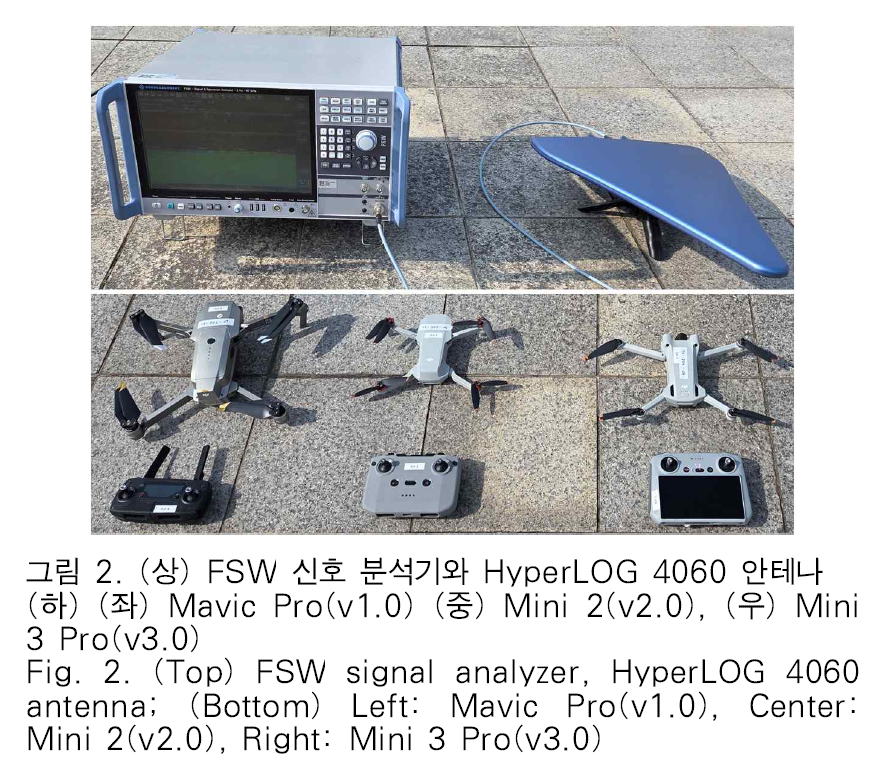
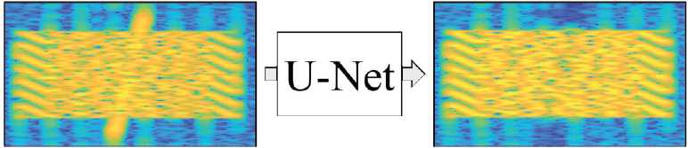
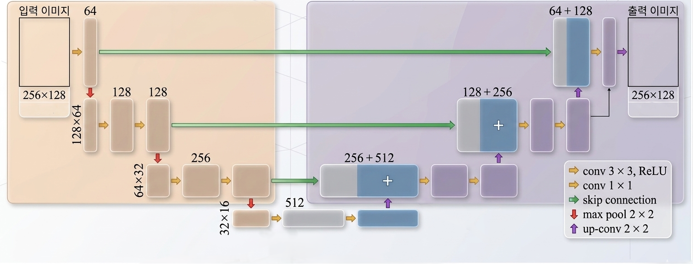

## 문제 정의

전자전·주파수 공존 환경에서는 레이다 신호와 통신 신호가 같은 대역에서 중첩될 수 있습니다. 이때 통신 신호의 구조를 보존하면서 레이다 간섭을 분리하고, OFDM 수신·복조 단계까지 연결하는 수신 체인이 필요합니다.

*드론 OFDM 신호와 레이더 간섭이 함께 관측되는 실험 환경*

## 제안 방법

  OFDM 수신<b>→</b>동기화·구조 분석<b>→</b>중첩 신호 식별<b>→</b>레이다 간섭 제거<b>→</b>OFDM 복조

- DJI OcuSync 프로토콜 기반 OFDM 신호의 구조를 분석하고 수신 처리 흐름을 구성합니다.
- 레이더와 통신 신호가 중첩되는 조건에서 관측 신호를 분석하고 간섭 성분을 제거하는 방향으로 처리합니다.
- 신호 수신부터 복조까지 이어지는 실제 신호처리 구현을 통해 알고리즘과 시스템 적용 사이의 연결을 확인합니다.

*U-Net 기반 레이더·통신 중첩 신호 분리 구조*

## 실제 검증

- **연구과제:** DJI OcuSync 프로토콜 기반의 OFDM 드론 신호 복조 구현
- **수행기관:** 엘아이지넥스원 (LIG)
- **기간:** 2024.03–현재
- **검증 범위:** OFDM 신호 수신·복조 구현과 레이다 간섭 제거를 위한 신호처리 체인

실제 프로토콜 기반 OFDM 신호를 대상으로 수신 및 복조 연구를 수행했습니다.

## 주요 결과

  OFDM 수신레이다 간섭 제거DJI OcuSync 복조

*간섭 제거 전후의 OFDM 신호 복원 결과*

DJI OcuSync 프로토콜 기반 OFDM 드론 신호 복조 구현을 통해 공존 신호 환경의 수신 처리 연구를 실제 신호처리 체인으로 확장했습니다.

[관련 수행 과제 보기](../../rd-projects/)
