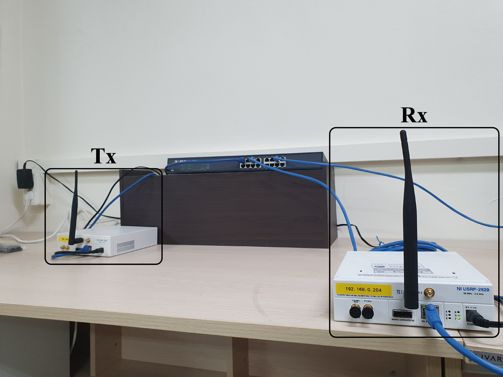

## 문제 정의

잡음에 묻힌 레이다 펄스의 위치와 경계를 찾아 주요 신호 제원을 얼마나 안정적으로 추정할 수 있는가?

저 SNR 환경에서는 시간 영역에서 펄스가 잡음과 구분되지 않고, pulse edge가 무너지면서 ToA, PW, PRI뿐 아니라 BW와 Fc의 추정 오차도 증가합니다.

## 제안 방법

  Received I/Q<b>↓</b>Frequency-domain pulse detection<b>↓</b>Pulse interval localization<b>↓</b>STFT<b>↓</b>UNet denoising<b>↓</b>CCA edge detection<b>↓</b>ToA · PW · PRI · BW · Fc

1. 수신 I/Q stream을 고정된 time slot으로 나누고, 주파수 영역 pulse detection으로 pulse-containing 구간을 먼저 찾습니다.
2. 필요한 구간만 STFT로 변환해 시간·주파수 해상도에 맞춘 UNet denoising을 적용합니다.
3. CCA로 고립된 성분을 제거하고 복원된 시간·주파수 경계에서 레이다 제원을 계산합니다.

[고해상도 경계 추출 Figure PDF](figures/edge_based_parameter_estimation.pdf)

## 실제 검증

- **Simulation:** 17종 intrapulse-modulation waveform, pulse width 1–10 ms, SNR −20–10 dB
- **Dataset:** waveform·SNR별 100개 pulse train, 총 52,700개, train/validation/test = 8:1:1
- **OTA test-bed:** GNU Radio로 제어한 USRP-2920 2대, center frequency 910 MHz, sampling rate 500 kHz

실제 무선 채널에서도 제안한 검출·제원 추정 체인이 동작하는지 확인했습니다.

[USRP OTA test-bed Figure PDF](figures/ota_testbed_setup.pdf)

## 주요 결과

  
<strong class="research-metric-value">0.912</strong>FPD AUC @ −18 dB

  
<strong class="research-metric-value">0.964</strong>FPD AUC @ −15 dB

  
<strong class="research-metric-value">8 · 16 · 6 μs</strong>ToA · PW · PRI RMSE @ −8 dB

FPD는 −18 dB에서 AUC **0.912**, −15 dB에서 AUC **0.964**를 기록했습니다. −8 dB 조건에서 시간영역 제원 추정 RMSE는 ToA 8 μs, PW 16 μs, PRI 6 μs였습니다.

[AUC 결과 PDF](figures/pulse_detection_auc.pdf)

관련 논문: [High-Accuracy Radar Parameter Estimation Under Low SNR Environments](../../publications/lpi-radar-parameter-estimation/) · *IEEE Access*, 2025
