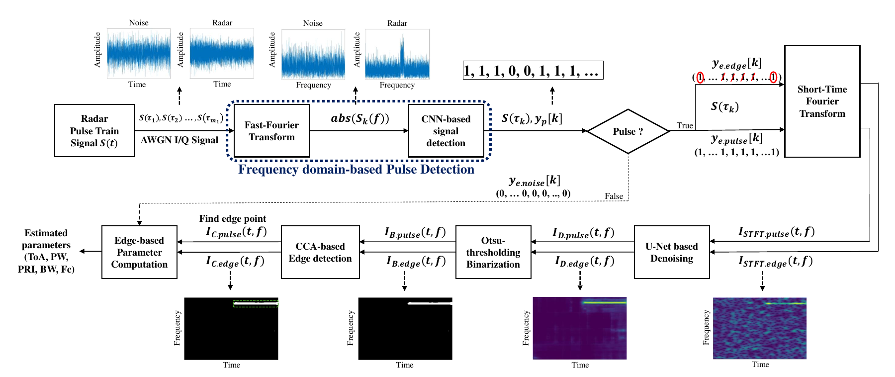
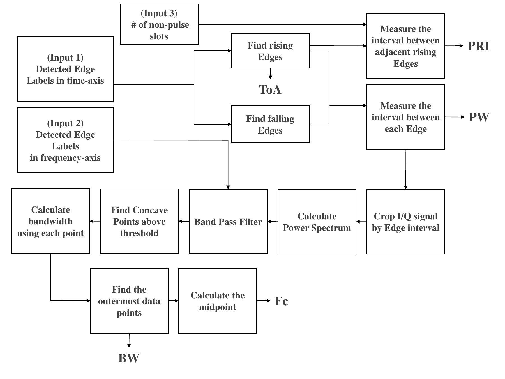
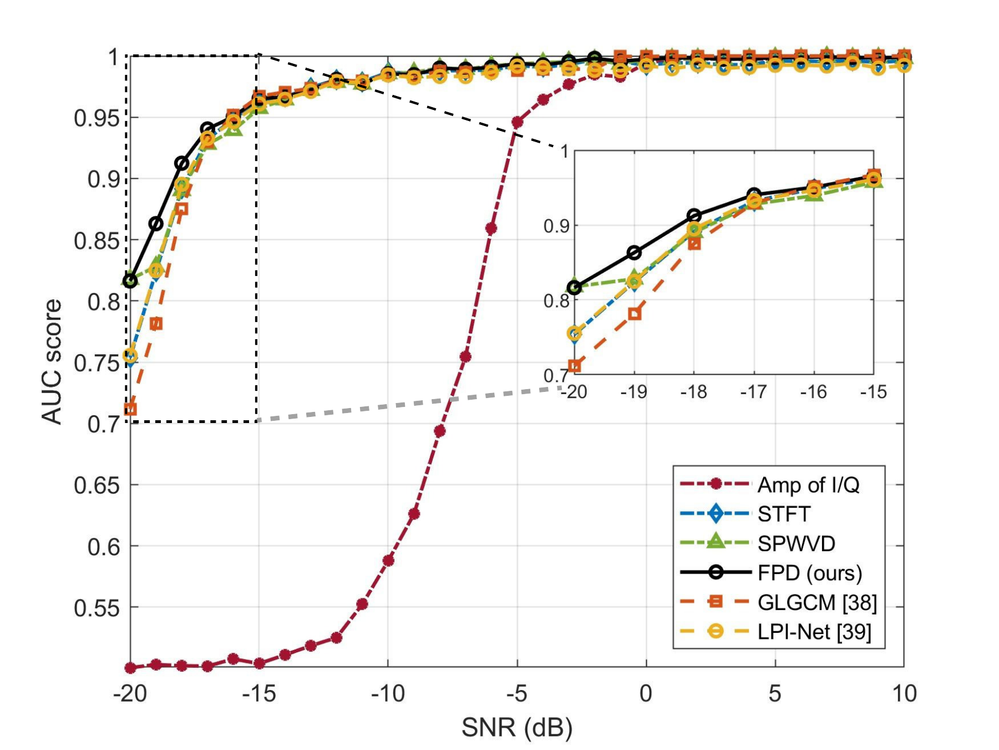

# High-Accuracy Radar Parameter Estimation Under Low SNR Environments

## Research question

How can a receiver recover reliable radar pulse boundaries and physical parameters when the pulse is difficult to distinguish from noise in the time domain and its time-frequency structure is fragmented?

## Proposed approach

The method separates coarse pulse observability from fine parameter extraction:

1. Divide the received I/Q stream into fixed, non-overlapping time slots.
2. Apply frequency-domain pulse detection (FPD) to decide whether each slot contains pulse energy.
3. Localize pulse-relevant intervals and generate STFT images with task-specific time/frequency resolution.
4. Apply separately optimized U-Net denoisers to suppress noise while preserving pulse structure.
5. Use connected-component analysis (CCA) to remove isolated components and extract temporal and spectral edges.
6. Compute time-domain parameters (ToA, PW, PRI) and frequency-domain parameters (BW, carrier frequency) from the recovered boundaries.

[Open the high-resolution Figure PDF](figures/edge_based_parameter_estimation.pdf)

## Experimental protocol

- **Simulation waveforms:** 17 intrapulse-modulation waveform types, including rectangular, LFM, NLFM, non-Costas FSK, Costas, Barker, Frank, and P1–P4.
- **Sampling rate:** 500 kHz.
- **Pulse width:** 1–10 ms; duty cycle fixed at 20%.
- **SNR range:** −20 to 10 dB in 1 dB increments.
- **Simulation set:** 100 pulse trains per waveform type and SNR, for 52,700 pulse trains total; train/validation/test split 8:1:1.
- **OTA test-bed:** two USRP-2920 devices controlled by GNU Radio, 910 MHz center frequency, 500 kHz sampling rate, measured SNR from −15 to 5 dB in 5 dB increments.
- **Baselines:** I/Q amplitude, STFT, SPWVD, GLGCM, LPI-Net, Wigner–Hough transform (WHT), change-point detection (CPD), and DAT-Net, depending on the subtask.

## Key results

### Slot-level pulse presence detection

The proposed FPD reaches AUC **0.912 at −18 dB** and **0.964 at −15 dB**, with the highest accuracy, precision, and AUC among the reported methods at those operating points.

| SNR | Method | Accuracy | Precision | Recall | F1 | AUC |
| --- | --- | ---: | ---: | ---: | ---: | ---: |
| −18 dB | I/Q amplitude | 75.7% | 0.270 | 0.024 | 0.045 | 0.502 |
| −18 dB | STFT | 95.2% | 0.968 | 0.790 | 0.870 | 0.892 |
| −18 dB | SPWVD | 94.9% | 0.954 | 0.790 | 0.864 | 0.890 |
| **−18 dB** | **FPD (ours)** | **95.7%** | **0.988** | 0.828 | 0.901 | **0.912** |
| −18 dB | GLGCM | 81.3% | 0.804 | 0.999 | 0.891 | 0.875 |
| −18 dB | LPI-Net | 89.5% | 0.984 | 0.744 | 0.904 | 0.895 |
| −15 dB | I/Q amplitude | 76.1% | 0.303 | 0.025 | 0.047 | 0.504 |
| −15 dB | STFT | 98.2% | 0.977 | 0.931 | 0.953 | 0.963 |
| −15 dB | SPWVD | 98.1% | 0.984 | 0.918 | 0.950 | 0.957 |
| **−15 dB** | **FPD (ours)** | **98.3%** | **0.994** | 0.930 | 0.961 | **0.964** |
| −15 dB | GLGCM | 92.7% | 0.913 | 0.999 | 0.955 | 0.962 |
| −15 dB | LPI-Net | 96.1% | 0.982 | 0.942 | 0.962 | 0.961 |

### Time-domain parameter estimation

| Parameter | Method | −16 dB (μs) | −12 dB (μs) | −8 dB (μs) |
| --- | --- | ---: | ---: | ---: |
| ToA | WHT | 378 | 203 | 162 |
| ToA | CPD | 405 | 211 | 114 |
| ToA | DAT-Net | 405 | 272 | 133 |
| ToA | Proposed without denoising | 475 | 479 | 278 |
| **ToA** | **Proposed** | **348** | **126** | **8** |
| PW | WHT | 593 | 331 | 245 |
| PW | CPD | 832 | 319 | 137 |
| PW | DAT-Net | 753 | 549 | 330 |
| PW | Proposed without denoising | 928 | 915 | 519 |
| **PW** | **Proposed** | **589** | **180** | **16** |
| PRI | WHT | 407 | 243 | 207 |
| PRI | CPD | 551 | 299 | 123 |
| PRI | DAT-Net | 521 | 425 | 230 |
| PRI | Proposed without denoising | 401 | 415 | 319 |
| **PRI** | **Proposed** | **400** | **159** | **6** |

The selected U-Net configuration is `(N_f, N_e, S_f) = (8, 7, 7)` for time-domain estimation and `(8, 5, 7)` for frequency-domain estimation. At −8 dB, the reported RMSE is 8 μs for ToA, 16 μs for PW, and 6 μs for PRI.

[Open the AUC Figure PDF](figures/pulse_detection_auc.pdf) · [Full pulse-detection table](../../research-tables/low-snr-radar-parameter-estimation/tables/ch3_pulse_detection/) · [Full parameter-RMSE table](../../research-tables/low-snr-radar-parameter-estimation/tables/ch3_parameter_rmse/)

## Why it matters

Reliable slot-level observability is a prerequisite for all downstream processing. The method uses frequency-domain evidence to identify pulse-containing regions, then spends higher-resolution STFT and denoising computation only where parameter extraction is meaningful.

## Publication

Jaehyeok Yoon, Siho Lee, Woojin Yun, and Haewoon Nam, “High-Accuracy Radar Parameter Estimation Under Low SNR Environments,” *IEEE Access*, vol. 13, pp. 171170–171184, 2025. [DOI](https://doi.org/10.1109/ACCESS.2025.3614172)
