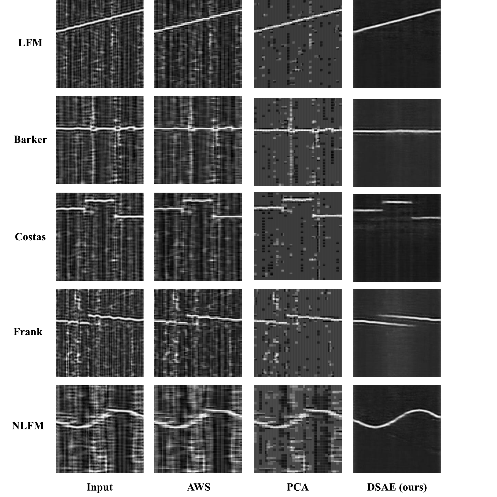

# Unsupervised Unknown Radar Waveform Detection

## Research question

Can a receiver detect unseen radar waveform types when unknown-class labels and clean reference signals are unavailable during training?

## Proposed approach

The framework combines two deliberately separated components:

- **DSAE (deep shrinkage autoencoder):** learns a compact, noise-suppressed representation from noisy CWD-based time-frequency inputs without paired clean targets.
- **MAAE (memory-based additional autoencoder):** reconstructs the denoised representation through memory entries learned from known waveform patterns. The known-biased memory makes unseen structures more likely to produce a larger reconstruction discrepancy.

The resulting reconstruction error is used as a continuous known/unknown score. Evaluation emphasizes AUC because a fixed operating threshold depends on the deployment trade-off between false unknown alarms and missed unknown detections.

[Open the high-resolution denoising Figure PDF](figures/denoising_method_comparison.pdf)

## Experimental protocol

- **Waveform families:** LFM, NLFM, Costas, Barker, Frank, P1, P2, P3, P4, T1, T2, T3, and T4.
- **Representation:** CWD time-frequency analysis (CWD-TFA).
- **Unknown protocols:** one-vs-rest and multiple-vs-rest; both 5-waveform and 9-waveform settings are evaluated.
- **Channel conditions:** AWGN, Rayleigh fading, and USRP-based measured wireless conditions.
- **Rayleigh setting:** randomly selected path delays from 1 ns to 1000 ns, average path gains from −20 dB to 0 dB, and maximum Doppler shifts from 10 Hz to 1000 Hz.
- **Hyperparameter grid:** latent vector size `e ∈ {2, 4, 8, 16, 32, 64, 128, 256}` and memory size `N ∈ {10, 30, 60, 100}`.
- **Balanced configuration reported in the source:** `e = 4`, `N = 30`; a smaller `e` can be effective at moderate SNR, while a somewhat larger `e` may preserve more structure at harsher SNR.

## Key results

- In the **5-waveform** setting, the reported AUC remains above **0.77 for SNR ≥ −12 dB**.
- In the more diverse **9-waveform** setting, the reported AUC remains above **0.78 for SNR ≥ −10 dB**.
- The measured wireless condition shows an approximate **4 dB performance gap** under challenging SNR levels relative to AWGN, while performance becomes comparable to the AWGN condition above approximately **−8 dB**.
- The two-stage training strategy is preferred because joint training can make reconstruction too flexible and reduce the known/unknown error gap.
- Increasing memory size beyond a moderate setting does not guarantee better separation; larger memory can preserve overly detailed patterns and reduce anomaly separability.

[Open the AUC Figure PDF](figures/one_vs_rest_auc_9_waveforms.pdf) · [Model-efficiency table](../../research-tables/unsupervised-unknown-radar-waveform-detection/tables/ch4_model_efficiency/) · [Waveform parameter table](../../research-tables/unsupervised-unknown-radar-waveform-detection/tables/ch4_waveform_parameters/)

## Computational profile

The reported software/GPU comparison was measured on an NVIDIA RTX 3090. It is a deployment-oriented comparison, not an FPGA resource result; RFNoC/FPGA validation is treated separately in the fourth project.

| Model | Structure | Models | Size (MB) | Parameters | MACs | Inference (ms) | Memory (MB) |
| --- | --- | ---: | ---: | ---: | ---: | ---: | ---: |
| TDL | CNN + RF | 4 | 2.60 | 655.8k | 37.4M | 10.42 | 22.79 |
| TCN | AWS + TCN | 2 | 2.62 | 683.9k | 221.6M | 2.45 | 21.54 |
| Proposed | DSAE + MAAE | 2 | 3.06 | 1.0M | 790.5M | 3.04 | 36.00 |

## Why it matters

The binary known/unknown detector addresses an incomplete-library setting: a receiver can flag a waveform as unseen without requiring a clean template or an exhaustive list of future waveform classes. The limitation is that this stage does not identify the semantic class of an unknown waveform; joint known-class recognition and unknown rejection are addressed in the SAVOR project.

## Publication

Jaehyeok Yoon and Haewoon Nam, “Unsupervised Unknown Radar Waveform Detection,” *IEEE Transactions on Aerospace and Electronic Systems*, vol. 61, no. 6, pp. 19316–19328, 2025. [DOI](https://doi.org/10.1109/TAES.2025.3618820)
