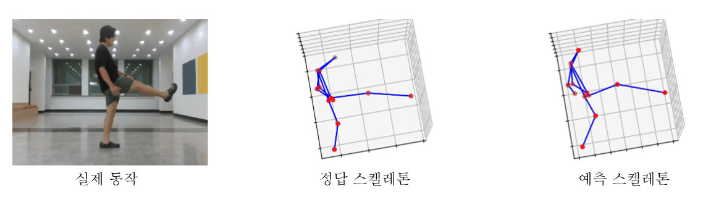

## 연구 배경과 필요성

RGB-D 카메라는 관절 위치와 자세를 직접 추정할 수 있지만 가림과 조명 변화에 영향을 받습니다. 레이다는 조명과 시야 변화에 비교적 강하고 공간 정보를 제공하지만 포인트 클라우드가 희소합니다. 두 센서의 장점을 결합하면 단일 센서의 한계를 보완하는 인체 모션 인지 연구가 가능합니다.

## 문제 정의

카메라는 사람의 자세와 관절 위치를 잘 보여주지만 가림과 조명 변화에 취약하고, 레이다는 시야와 조명에 강하지만 포인트 클라우드가 희소합니다. 두 센서의 정보를 같은 좌표계에서 정렬하면 카메라의 자세 정보와 레이다의 공간 정보를 함께 활용할 수 있습니다.

## 제안 방법

  RGB-D 입력<b>→</b>스켈레톤 추정<b>→</b>레이다 포인트 매핑<b>→</b>관절별 특징 추출<b>→</b>모션 인지

- RGB-D 프레임에서 인체 스켈레톤을 추정하고 관절별 기준점을 구성합니다.
- 레이다 포인트 클라우드와 스켈레톤 관절 정보를 정렬해 신체 부위별 포인트 밀도와 공간 특징을 추출합니다.
- 정렬된 멀티센서 특징을 활용해 인체 모션과 관절 단위 상태를 인지합니다.

## 실제 검증

- RGB-D 카메라와 레이다 포인트 클라우드를 동일 프레임 기준으로 동기화했습니다.
- 스켈레톤 관절 주변의 레이다 포인트를 매핑하고 관절별 특징을 비교했습니다.
- 멀티센서 입력을 활용한 인체 모션 인지와 스켈레톤 추출 가능성을 확인했습니다.

## 주요 결과

  스켈레톤 추정포인트 매핑멀티센서 모션 인지

*실제 동작, 정답 스켈레톤, 예측 스켈레톤을 비교한 결과*

카메라 기반 자세 정보와 레이다 기반 공간 정보를 결합하는 멀티센서 연구를 통해, 단일 센서의 가림·희소성 문제를 보완하는 인체 모션 인지 구조를 검토했습니다.
