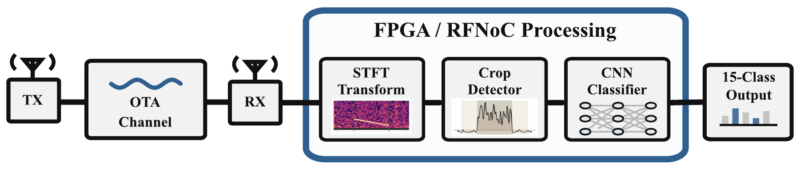
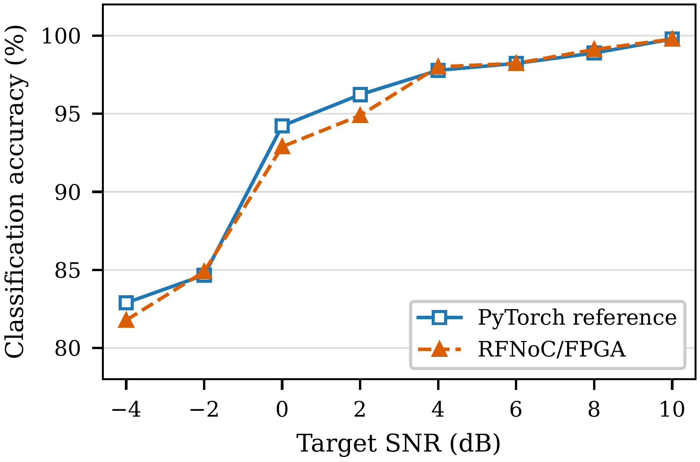

## 문제 정의

소프트웨어에서 동작하는 레이다 detector–classifier를 실제 수신 시스템에 적용하려면 연산량, 데이터 이동, fixed-point 표현과 실시간 처리 지연을 함께 고려해야 합니다.

이 연구는 대표적인 레이다 신호처리 체인을 SDR/FPGA로 옮겼을 때 알고리즘 성능을 유지하면서 OTA 환경에서 종단간 동작을 확인할 수 있는지를 검증합니다.

## 제안 방법

  USRP TX<b>→</b>OTA channel<b>→</b>USRP RX<b>→</b>Fixed-point STFT<b>→</b>RFNoC detector<b>→</b>HLS CNN<b>→</b>Radar class

- **STFT front-end:** 128-point FFT와 64-sample hop으로 1 × 64 × 31 feature를 구성합니다.
- **Streaming detector:** STFT power frame에서 DC 관련 bin을 제거하고 pulse-train interval을 thresholding합니다.
- **HLS classifier:** 15종 waveform class를 출력하는 CNN을 HLS 기반 streaming 구조로 구현합니다.
- **Fixed-point implementation:** weight·bias·activation을 int8·int32·uint8 표현으로 변환하고 RFNoC 데이터 경로에 연결합니다.

[처리 구조 PDF](figures/rfnoc_processing_architecture.pdf)

## 실제 검증

- **OTA records:** 3,600개 수신 기록
- **Waveform classes:** 15종
- **Target SNR:** −4–10 dB, 2 dB 간격의 8개 조건
- **Reference:** 동일 기록에 대한 Python/PyTorch implementation
- **Evaluation:** interval match, P_cov,95, packet success, classification accuracy, end-to-end success

USRP 송·수신기와 OTA channel을 포함한 수신 체인에서 detector와 classifier의 동작을 확인하고, software reference와 FPGA 결과의 차이를 비교했습니다.

## 주요 결과

  
<strong class="research-metric-value">3,600</strong>OTA records

  
<strong class="research-metric-value">99.25%</strong>P_cov,95

  
<strong class="research-metric-value">93.14%</strong>End-to-End accuracy

RFNoC/FPGA classifier accuracy는 **93.69%**였으며, integrated end-to-end 성능은 **93.14%**였습니다.

[정확도 결과 PDF](figures/classification_accuracy_by_snr.pdf) · [Classifier structure](../../research-tables/rfnoc-fpga-radar-detector-classifier/tables/ch6_classifier_architecture/)

이 연구는 저 SNR parameter-estimation framework, DSAE-MAAE unknown detector, SAVOR Open-Set Recognizer 자체를 FPGA에 구현했다고 주장하지 않고, detector–CNN classifier 체인의 하드웨어 구현 가능성을 검증한 것입니다.

[RFNoC/FPGA 기반 LPI 레이다 펄스열 검출 및 분류기 구현](../../publications/rfnoc-fpga-lpi-detection/) · 한국통신학회 국내논문지 · 게재 확정
