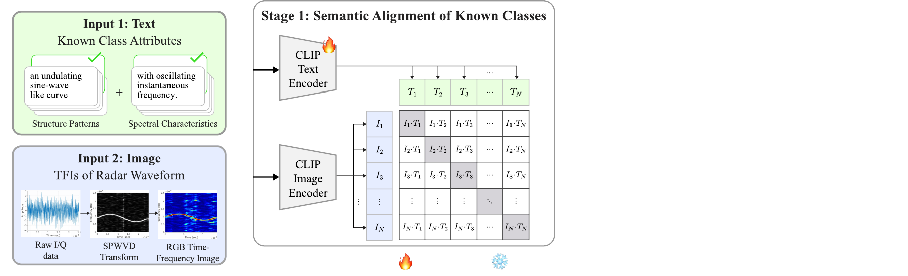
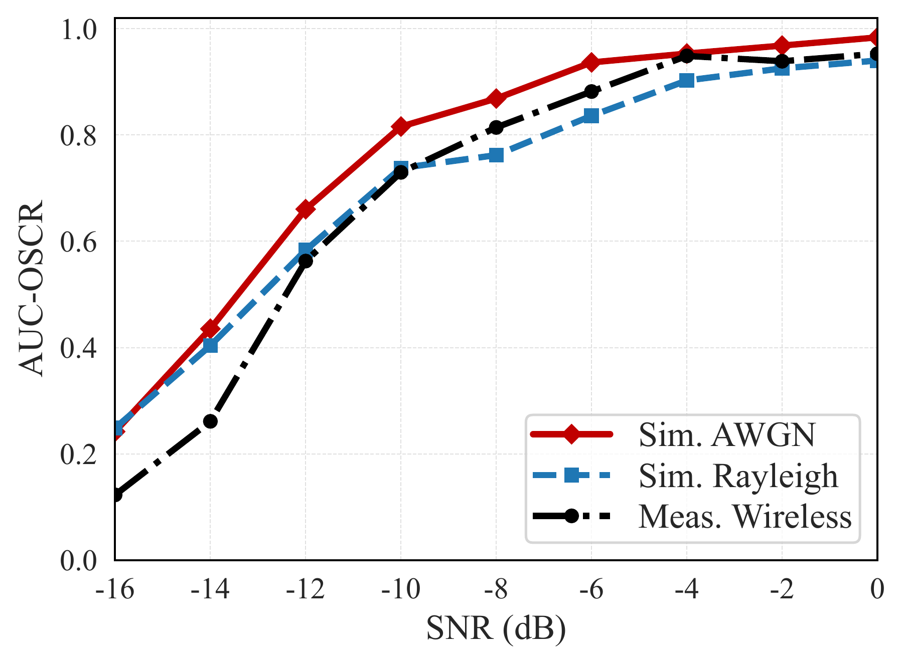
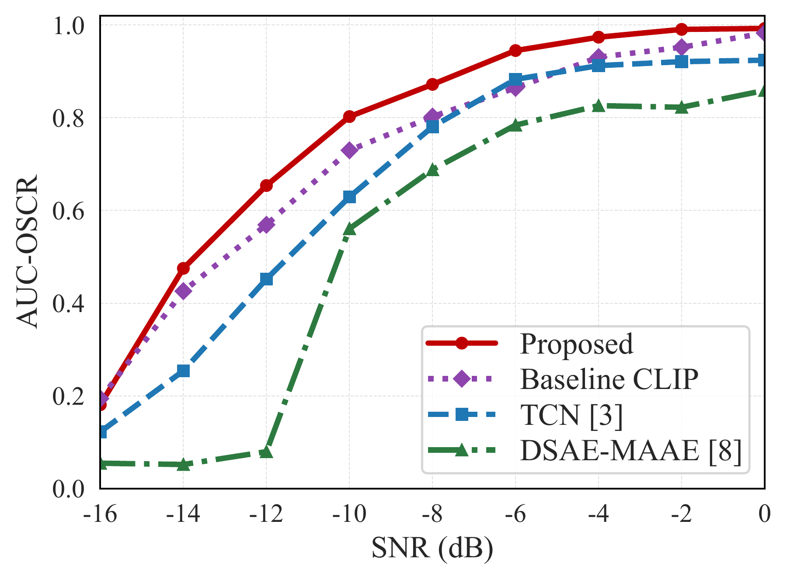

## 문제 정의

일반적인 closed-set 분류기는 학습에 포함되지 않은 파형도 기존 class 중 하나로 분류합니다. 레이다 신호가 서로 유사한 시간–주파수 구조를 가질수록 unknown rejection과 known-class recognition을 동시에 유지하기 어렵습니다.

이 연구는 **known waveform과 구조적으로 유사한 unknown waveform을 semantic representation으로 구분할 수 있는가**를 다룹니다.

[Closed-set and open-set recognition Figure PDF](figures/closed_set_vs_open_set.pdf)

## 제안 방법

  Radar I/Q<b>→</b>SPWVD<b>→</b>Time-frequency image<b>+</b>Structural pattern · Spectral characteristics<b>→</b>VLM / CLIP alignment<b>→</b>Known classification + unknown rejection

- **Semantic attribute:** 시간–주파수 영상의 구조적 패턴과 스펙트럼 특성을 문장 기반 attribute로 표현합니다.
- **Vision-Language alignment:** 레이다 영상과 attribute text를 같은 표현 공간에 정렬합니다.
- **Unknown-aware learning:** TDU(Text-Driven Unknown Modeling)와 IVU(Image-Space Virtual Unknown Modeling)를 이용해 unknown-aware representation을 구성합니다.

[Unknown-aware learning Figure PDF](figures/unknown_aware_learning.pdf)

## 실제 검증

- **Waveform set:** 15종 레이다 파형을 대상으로 known/unknown 조합을 구성했습니다.
- **Open-set protocol:** single unknown과 two unknown 설정에서 known-class recognition과 unknown rejection을 함께 평가했습니다.
- **Channel conditions:** AWGN, Rayleigh fading, measured wireless 조건에서 AUC-OSCR을 비교했습니다.
- **Evaluation:** closed-set baseline, semantic attribute 기반 모델, SAVOR 구성의 성능을 동일한 조건에서 비교했습니다.

[Channel-wise AUC-OSCR Figure PDF](figures/channel_auc_oscr.pdf)

## 주요 결과

  
<strong class="research-metric-value">+0.05</strong>AUC-OSCR average improvement

  
<strong class="research-metric-value">+0.10</strong>Maximum gain in challenging low-SNR settings

  
<strong class="research-metric-value">3</strong>AWGN · fading · measured validation settings

이 연구는 레이다 신호처리를 semantic VLM 표현 학습과 연결해, 단순 confidence threshold보다 구조와 의미를 반영한 unknown rejection을 수행했습니다. 이후 경량화와 실시간 구현으로 확장할 수 있는 기반도 함께 마련했습니다.

[SAVOR: Semantic Attribute-Guided Vision-Language Framework for Open-Set Radar Waveform Recognition](../../publications/semantic-attribute-guided-open-set-radar/) · *IEEE Transactions on Aerospace and Electronic Systems*

Joint Recognition of LPI Radar Signals Using a VLM with TFD-Text Alignment · ICNGC, 2025 · **Best Paper Award**
