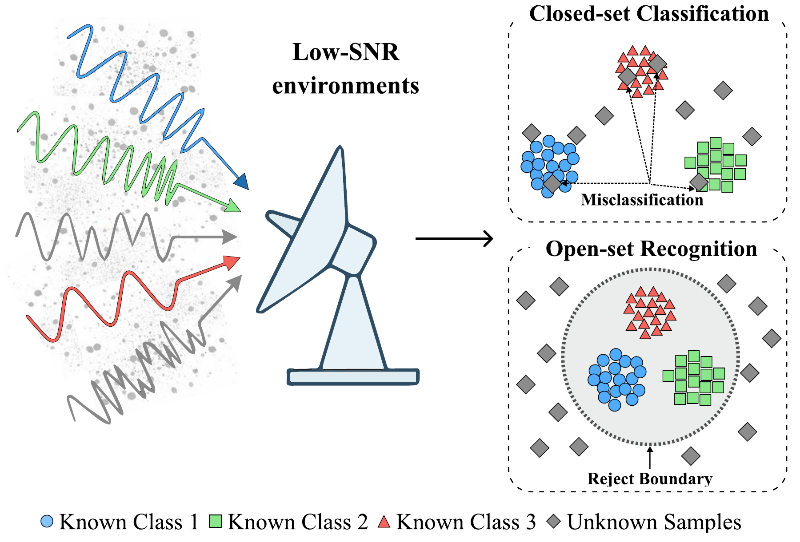
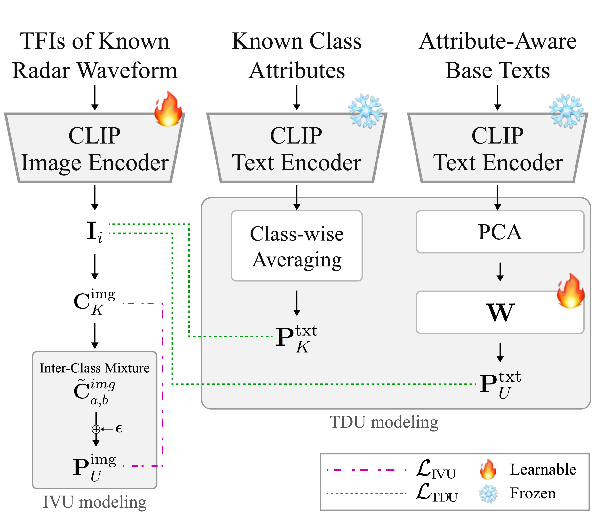

# SAVOR: Semantic Attribute-Guided Vision-Language Framework for Open-Set Radar Waveform Recognition

## Research question

How can a radar receiver classify known waveform classes while rejecting unseen waveform types, especially when low SNR makes visually similar time-frequency structures hard to separate?

## Proposed approach

SAVOR treats radar time-frequency representations as visual inputs and uses waveform-related semantic descriptions as structured auxiliary supervision.

1. Convert raw I/Q signals into SPWVD-based time-frequency images.
2. Construct known-class attribute texts by composing structural patterns and spectral characteristics.
3. Use a CLIP-style image/text embedding space for Stage 1 semantic alignment.
4. Use **TDU** (text-driven unknown modeling) to introduce generic unknown semantic directions.
5. Use **IVU** (image-space virtual unknown modeling) to regularize ambiguous regions near known-class boundaries.
6. At inference, compare an image embedding with known-class prototypes; accept the highest-scoring known class only when its similarity exceeds the rejection threshold, otherwise reject the sample as unknown.

[Open the high-resolution Figure PDF](figures/closed_set_vs_open_set.pdf) · [Semantic attribute table](../../research-tables/savor-open-set-radar-waveform-recognition/tables/ch5_semantic_attributes/) · [Base-text template table](../../research-tables/savor-open-set-radar-waveform-recognition/tables/ch5_base_texts/)

## Experimental protocol

- **Waveform set:** LFMD, LFMU, NLFMT, NLFMS, Barker, Costas, Frank, P1, P2, P3, P4, T1, T2, T3, and T4.
- **Unknown settings:** single-unknown and two-unknown protocols.
- **Channel settings:** AWGN, simulated Rayleigh fading, and measured wireless conditions.
- **Primary metric:** AUC-OSCR, jointly measuring known-class correctness and unknown rejection.
- **Additional metrics:** AUROC, AUPRC, FPR95, and known-class accuracy.

[Open the unknown-aware-learning Figure PDF](figures/unknown_aware_learning.pdf) · [Single-unknown AUC-OSCR](figures/single_unknown_auc_oscr.png) · [Channel AUC-OSCR](figures/channel_auc_oscr.png)

## Key result

The source study reports approximately **+0.05 average AUC-OSCR improvement** and up to approximately **+0.10** under challenging low-SNR conditions. The intended interpretation is a better trade-off between known-class recognition and unknown rejection while preserving known-class accuracy, rather than maximizing unknown rejection by simply rejecting more samples.

## Why it matters

Reconstruction-based unknown detection is useful for binary novelty screening, but a practical receiver also needs to recognize known waveforms. SAVOR extends the problem to open-set recognition by explicitly shaping the embedding space with interpretable waveform attributes and unknown-aware directions. The text descriptions are not an exhaustive dictionary of future unknown waveforms; they regularize the open space around known classes.

## Publication status

Jaehyeok Yoon and Haewoon Nam, “SAVOR: Semantic Attribute-Guided Vision-Language Framework for Open-Set Radar Waveform Recognition,” *IEEE Transactions on Aerospace and Electronic Systems*, Under Revision.
