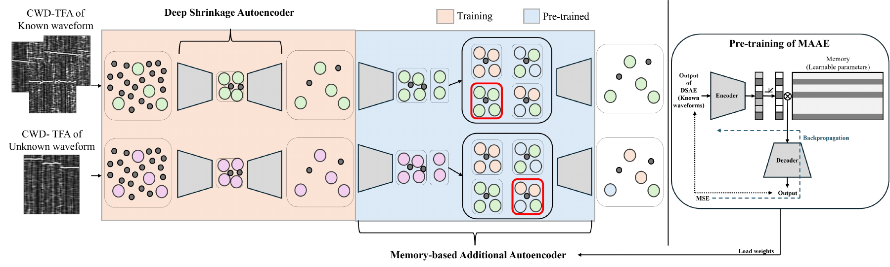

## 연구 질문

학습에 없던 파형이 입력되었을 때, **known waveform은 정확히 분류하면서 unknown waveform을 기존 class로 오분류하지 않고 거부할 수 있는가?**

이 질문을 **binary unknown detection**에서 시작해 **known-class recognition + unknown rejection** 문제로 확장했습니다. 첫 번째 연구는 reconstruction discrepancy로 미확인 파형을 탐지하고, 두 번째 연구는 파형의 구조와 스펙트럼 의미를 표현 공간에 반영합니다.

## 연구 발전 과정

  
<strong>2022</strong>Autoencoder 기반 미확인 레이다 파형 탐지

  
<strong>2025</strong>DSAE-MAAE: 비지도 denoising과 memory 기반 미확인 파형 탐지

  
<strong>2025</strong>VLM과 TFD–Text Alignment를 활용한 파형 인식

  
<strong>2026</strong>SAVOR: semantic attribute, TDU, IVU 기반 Open-Set Recognition

## Study 1 · Reconstruction-Based Unknown Detection

### 처리 흐름

  Radar I/Q<b>↓</b>CWD time-frequency representation<b>↓</b>DSAE<b>↓</b>Noise-suppressed representation<b>↓</b>MAAE<b>↓</b>Memory-based reconstruction<b>↓</b>Reconstruction discrepancy<b>↓</b>Known / Unknown

### 핵심 방법

- **DSAE:** clean reference 없이 noisy input만으로 저 SNR 레이다 파형의 구조적 특징을 보존하면서 noise를 억제합니다.
- **MAAE:** known waveform pattern을 memory로 학습하고 known / unknown 간 reconstruction discrepancy를 이용해 미확인 파형을 탐지합니다.
- reconstruction discrepancy를 연속적인 score로 사용해 운영 환경의 false-alarm과 missed-detection trade-off를 조정합니다.

[DSAE–MAAE framework PDF](figures/dsae_maae_framework.pdf) · [Denoising comparison](figures/denoising_method_comparison.pdf) · [AUC result](figures/one_vs_rest_auc_9_waveforms.pdf)

### 대표 결과

- **5-waveform:** SNR ≥ −12 dB에서 AUC > 0.77
- **9-waveform:** SNR ≥ −10 dB에서 AUC > 0.78

  AWGNRayleigh FadingMeasured Wireless

## 다음 연구가 필요했던 이유

Reconstruction-based detection은 known waveform pattern에서 벗어난 입력을 탐지하는 데 효과적입니다.

그러나 unknown waveform이 known class와 유사한 **frequency sweep, hopping pattern, time-frequency structure**를 공유하는 경우 reconstruction discrepancy만으로는 충분히 분리하기 어렵습니다.

이를 해결하기 위해 semantic representation 기반 **Open-Set Recognition**으로 연구를 확장했습니다.

## Study 2 · Semantic Open-Set Radar Waveform Recognition

### SAVOR 처리 흐름

  Radar I/Q<b>↓</b>SPWVD<b>↓</b>Time-frequency image<b>+</b>Structural pattern · Spectral characteristics<b>↓</b>Vision-Language alignment<b>↓</b>Known classification + unknown rejection

단순 class label 대신 레이다 시간–주파수 영상의 **구조적 패턴과 스펙트럼 특성**을 semantic attribute로 표현합니다.

1. **Stage 1 · Known-class semantic alignment:** known waveform의 image-text alignment를 학습합니다.
2. **Stage 2 · Unknown-aware representation:** **TDU(Text-Driven Unknown Modeling)**와 **IVU(Image-Space Virtual Unknown Modeling)**를 이용해 unknown-aware representation을 구성합니다.

[SAVOR framework PDF](figures/savor_architecture.pdf) · [Unknown-aware learning](figures/unknown_aware_learning.pdf) · [Channel AUC-OSCR](figures/channel_auc_oscr.png)

### 대표 결과

  
<strong class="research-metric-value">+0.05</strong>AUC-OSCR 평균 개선

  
<strong class="research-metric-value">+0.10</strong>challenging low-SNR 환경 최대 개선

  AWGNRayleigh FadingMeasured WirelessUSRP OTA

목표는 단순히 더 많이 거부하는 것이 아니라, known-class recognition과 unknown rejection 사이의 trade-off를 개선하는 것입니다.

## 별도의 시스템 구현 연구

이와 병행한 별도의 시스템 구현 연구에서는 대표적인 **STFT detector–CNN classifier** 체인을 RFNoC/FPGA에 구현하여, OTA 환경에서 레이다 처리 알고리즘의 하드웨어 적용 가능성을 검증했습니다.

## 관련 논문 및 학회 발표

- Jaehyeok Yoon and Haewoon Nam, “[Unsupervised Unknown Radar Waveform Detection](../../publications/unknown-radar-waveform-detection/),” *IEEE Transactions on Aerospace and Electronic Systems*, vol. 61, no. 6, pp. 19316–19328, 2025. [DOI](https://doi.org/10.1109/TAES.2025.3618820)
- Jaehyeok Yoon and Haewoon Nam, “[SAVOR: Semantic Attribute-Guided Vision-Language Framework for Open-Set Radar Waveform Recognition](../../publications/semantic-attribute-guided-open-set-radar/),” *IEEE Transactions on Aerospace and Electronic Systems*, under revision.
- Jaehyeok Yoon, Haewoon Nam, and Jaerock Kwon (2025.12). “Joint Recognition of LPI Radar Signals Using a VLM with TFD-Text Alignment.” ICNGC, Da Nang, Vietnam. Best Paper Award.
- 윤재혁, 남해운 (2026.02.04). “지도 학습 기반 CLIP을 활용한 레이다 신호 스펙트로그램 식별.” 2026년도 한국통신학회 동계종합학술발표회, 용평.
