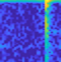
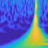
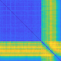
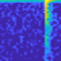
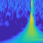
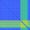

## 연구 배경과 필요성

UWB는 짧은 펄스와 넓은 대역폭을 이용해 정밀한 거리 측정이 가능하지만, 수신기와 송신기 사이에 장애물이 생기면 직접 경로가 가려지고 반사·회절 경로가 우세해질 수 있습니다. 이때 Channel Impulse Response(CIR)의 첫 도달 성분과 에너지 분포가 달라지면서 거리 측정에 편향이 발생합니다.

따라서 UWB 수신 신호를 사용하기 전에 현재 채널이 LOS인지 NLOS인지 판단하는 과정이 필요합니다. CIR에 포함된 시간 지연, 피크 크기, 에너지 분포와 다중경로 구조를 활용하면 채널 상태를 구분하고 NLOS 환경에서 발생하는 측정 신뢰도 저하를 사전에 판단할 수 있습니다.

## 문제 정의

LOS 환경에서는 직접 경로가 비교적 뚜렷하게 나타나지만, NLOS 환경에서는 벽·차량·건물 등에 의해 직접 경로가 약해지거나 사라지고 반사·회절 성분이 먼저 관측될 수 있습니다. 두 상태의 CIR 형태가 채널과 장애물 조건에 따라 달라지기 때문에 단순한 임계값만으로 모든 환경을 안정적으로 구분하기 어렵습니다.

본 연구의 목표는 UWB CIR에서 채널 상태를 설명하는 특징을 추출하고, 수신 구간을 LOS 또는 NLOS로 분류하는 것입니다. 이 페이지는 UWB 채널 상태 분류에 집중하며, 이후 거리 측정의 신뢰도를 판단하기 위한 전처리 단계로 활용될 수 있습니다.



## 제안 방법

  UWB 수신<b>→</b>CIR 획득<b>→</b>채널 특징 추출<b>→</b>LOS/NLOS 분류<b>→</b>NLOS detection

- CIR 구성 분석: 수신 신호에서 직접 경로와 다중경로가 나타나는 시간·에너지 구조를 확인합니다.
- 특징 추출: CIR의 도달 시간, 피크, 에너지 분포와 다중경로 형태를 채널 상태 분류를 위한 특징으로 사용합니다.
- 채널 상태 분류: 수신 구간을 LOS와 NLOS로 구분하고, NLOS 환경에서 발생하는 측정 신뢰도 저하를 식별합니다.
- 실험 비교: 장애물과 경로 조건이 달라지는 여러 실험 사례에서 분류 성능과 오분류 양상을 비교합니다.

## 실험 환경과 사례

UWB 송수신기와 기준 노드·태그를 이용해 직접 경로가 확보된 조건과 장애물로 인해 반사·회절 경로가 증가하는 조건을 구성했습니다. 동일한 CIR 기반 처리 흐름으로 각 채널 상태의 특징을 추출하고 LOS/NLOS 분류 결과를 비교했습니다.

  <figure>
    
    <figcaption>실험 사례 1</figcaption>
  </figure>
  <figure>
    
    <figcaption>실험 사례 2</figcaption>
  </figure>
  <figure>
    
    <figcaption>실험 사례 3</figcaption>
  </figure>
  <figure>
    
    <figcaption>실험 사례 4</figcaption>
  </figure>
  <figure>
    
    <figcaption>실험 사례 5</figcaption>
  </figure>
  <figure>
    
    <figcaption>실험 사례 6</figcaption>
  </figure>

*장애물과 경로 조건이 달라지는 UWB LOS/NLOS 채널 실험 사례*

## 주요 결과

  CIR 특징 추출LOS/NLOS 분류NLOS detection



CIR 기반 채널 특징을 이용해 직접 경로가 확보된 LOS와 장애물로 인해 다중경로가 우세한 NLOS를 구분하는 처리 흐름을 구성했습니다. 이를 통해 UWB 거리 측정이나 위치 추정 단계에서 채널 상태를 함께 고려할 수 있는 기반을 마련했습니다.

## 결론

UWB NLOS/LOS 분류는 정밀한 거리 측정과 위치 추정에 앞서 수신 채널의 신뢰도를 판단하는 핵심 단계입니다. 본 연구는 Channel Impulse Response에 나타나는 직접 경로와 다중경로의 차이를 특징으로 활용해 LOS/NLOS 채널 상태를 분류하고, NLOS 환경에서 발생하는 측정 편향을 식별하는 방법을 검토했습니다.

## Publication

Jaehyeok Yoon, Hyeongyun Kim, Dongho Seo, and Haewoon Nam, “Performance Comparison of NLOS Detection Methods in UWB,” *International Conference on ICT Convergence (ICTC)*, Jeju, Korea, Oct. 2021.
