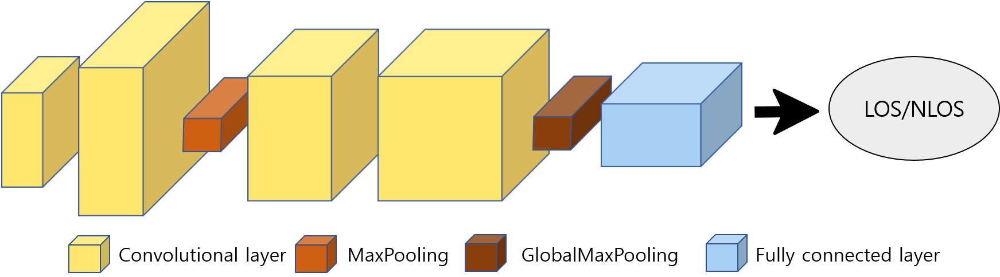
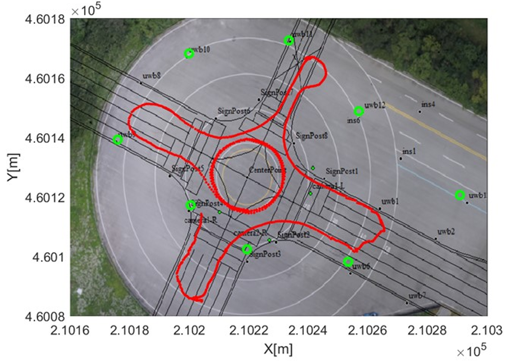
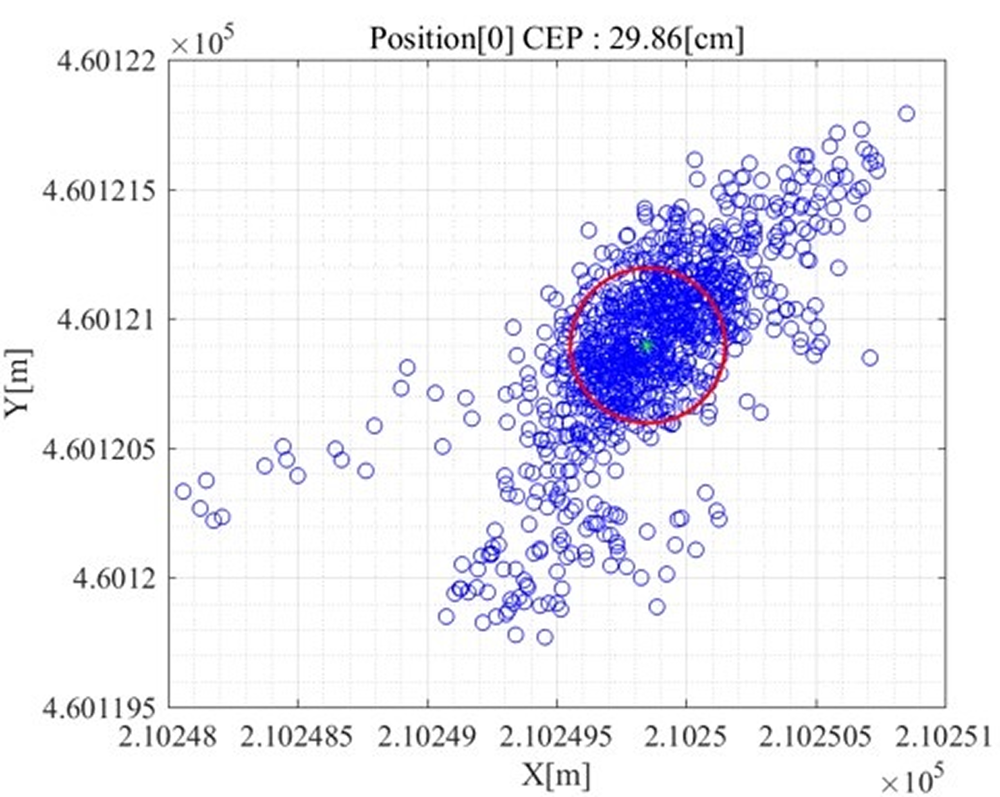

## 연구 배경과 필요성

UWB 수신 신호의 CIR(Channel Impulse Response)에는 직접 경로와 다중경로의 차이가 나타나므로, LOS·NLOS 상태를 구분하면 거리 측정의 신뢰도를 판단하는 데 도움이 됩니다. 한편 UWB 위치 측위는 여러 기준점의 시간 차이와 기하 정보를 이용해 대상의 위치를 추정하는 별도의 연구 문제입니다.

두 연구는 입력 특징, 목표, 평가 방법이 다릅니다. 따라서 이 페이지에서는 CIR 기반 LOS/NLOS 구분과 UWB 위치 측위를 서로 독립된 연구로 나누어 설명합니다.

## 연구 1. CIR 기반 LOS/NLOS 구분

### 문제 정의

벽·차량·건물 등으로 직접 경로가 가려지는 NLOS 환경에서는 CIR의 형태가 달라지고 거리 측정에 편향이 생길 수 있습니다. 이 연구는 CIR 기반 특징으로 LOS와 NLOS 채널 상태를 구분하고, NLOS detection 성능을 비교하는 데 초점을 둡니다.

*CIR에서 LOS/NLOS 채널 상태를 구분하기 위한 특징 추출 과정*

### 연구 방법과 검증

- CIR 기반 특징을 활용해 UWB 채널의 LOS/NLOS 상태를 구분합니다.
- **검증 연구:** *Performance Comparison of NLOS Detection Methods in UWB* · ICTC · 제주 · 2021.10

## 연구 2. UWB 위치 측위

### 문제 정의

자율주행 차량이 이동하는 야외 교차로에서는 여러 기준점의 측정값을 이용해 위치를 안정적으로 추정해야 합니다. 이 연구는 NLOS 상태 분류와 별개로, O-TDoA(Time Difference of Arrival) 기반 측정값을 이용한 위치 추정과 실제 적용 환경을 다룹니다.

### 연구 방법과 검증

  UWB 기준점·태그 신호<b>→</b>시간 차이 측정<b>→</b>O-TDoA 위치 추정<b>→</b>야외 교차로 적용

- 시간 차이 기반 측정값을 활용해 O-TDoA 위치를 추정합니다.
- **검증 연구:** *UWB O-TDoA Localization for Autonomous Vehicles in Outdoor Intersections*
- **적용 환경:** 야외 교차로에서 자율주행 차량의 UWB 기반 위치 측위

*실외 자율주행 환경에서의 UWB 위치 측위 실험*

## 주요 결과

### CIR 기반 LOS/NLOS 구분

  LOS/NLOS 구분CIR 특징 추출NLOS detection

### UWB 위치 측위

  O-TDoA localizationOutdoor intersectionPosition estimation

*O-TDoA 기반 위치 추정 결과*
